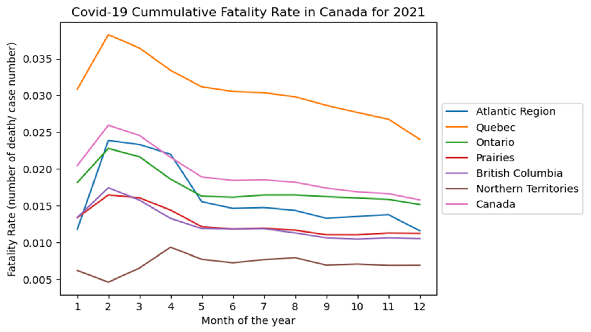

# COVID-19 Data Visualization

## Objective
Analyze COVID-19 epidemiology data in Canada and generate a line graph plotting the case fatality rate against months in 2021, stratified by Canadian Regions. 
Case fatality rate was calculated by dividing the number of deaths (in that month) by the number of cases. 

## Data Source
Source data was taken from the Government of Canada website, available publicly.  
[Source Data Website] (https://health-infobase.canada.ca/covid-19/?redir=1#tiles)

